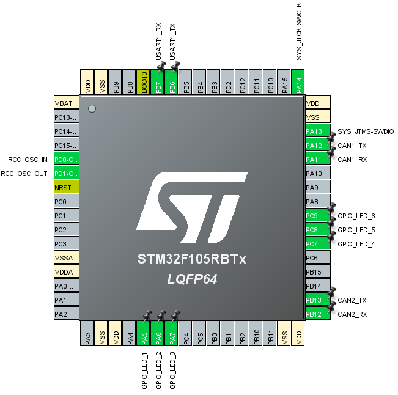
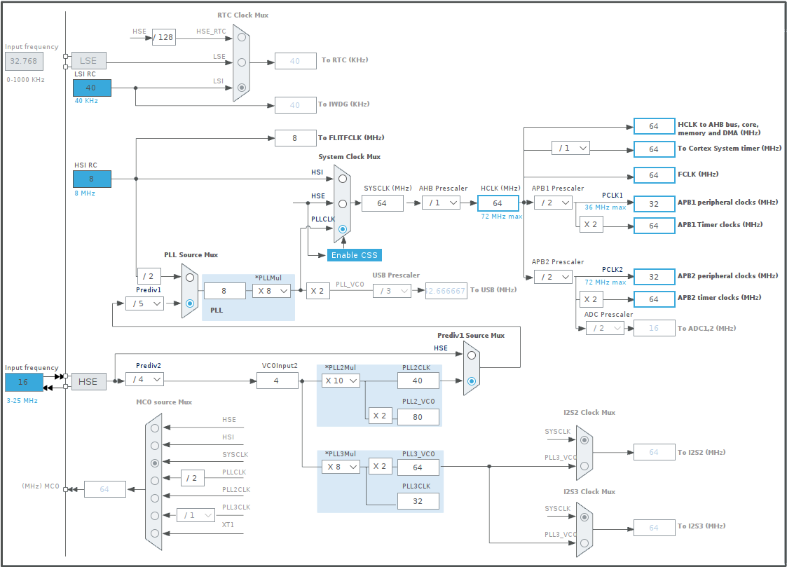

# PUT Motorsport - CAN Translator
The module is responsible for communication between the motor inverter and the main bus. The translator transmits the speed set signals from the measurement card and logs the parameters from the inverter. All communication takes place over the CAN bus.

## Authors
* Piotr Kwiatkowski
* Bartosz Ptak

## Device
We used our own PCB, which was equipped with 2 CAN transmitters and a STM32F105RB microcontroller.

## Hardware setup

### Pinouts

Active pinouts:

* CAN1_TX (`PA12`), CAN1_RX (`PA11`)
* CAN2_TX (`PB13`), CAN2_RX (`PB12`)
* RCC clock
* GPIO_LED_[1-6] for debugging

### Clocks

We used an external clock speed and set its frequency to **64 MHz** for (`HCLK`). This setting allowed to set the clock frequency of the peripherals to **32 MHz** (`PCLK1`).

### Timers

* `TIM2`:
    - **usage**: safety counting, 1 ms
    - **prescaler:** 999
    - **counter Period:** 63
    - **counter mode:** Up
    - **auto-reload:** Enable
* `TIM3`:
    - **usage**: send parameters to telemetry, 20 ms
    - **prescaler:** 19999
    - **counter Period:** 63
    - **counter mode:** Up
    - **auto-reload:** Enable

### CANs

* `CAN1`:
    - **usage**: main bus, measurement card, 500 kbps
    - **prescaler:** 4
    - **time quanta 1:** 13
    - **time quanta 2:** 2
    - **time quantum:** 125.0 ns

* `CAN2`:
    - **usage**: inverter bus, 500 kbps
    - **prescaler:** 4
    - **time quanta 1:** 13
    - **time quanta 2:** 2
    - **time quantum:** 125.0 ns